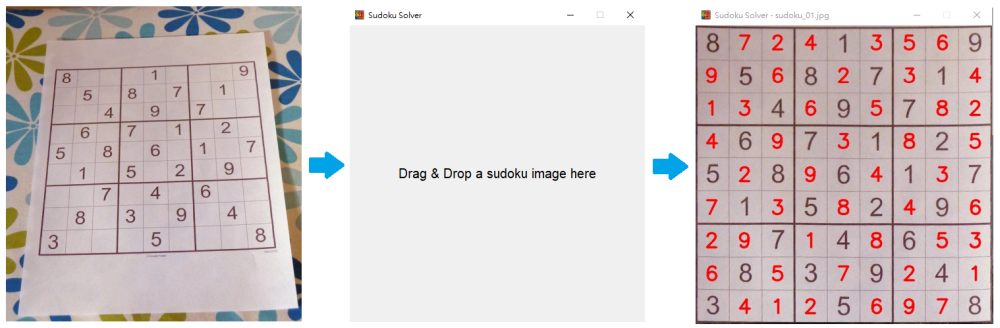

# A Drag & Drop Sudoku Solver

## Digits Recognition

I use the digit portions of the Chars74K-Digital-English-Font dataset(dataset1), specifically samples 002 to 010, to train a CNN to recognize digits (1 to 9).  
I then crop digits from collected Sudoku images(dataset2) for transfer learning, allowing the network to learn to recognize digits with noise, such as grid lines.

## Sudoku Grid Extraction

First, find the large quadrilateral contours in a Sudoku image. Then, select the contour that contains the most quadrilateral sub-contours, as this is most likely the Sudoku grid.

## Cells Extraction

I found that it is not easy to detect the sub-contours or lines in all the collected Sudoku images, so I simply split the Sudoku grid into 81 cells.

## Empty Cells

I did not train the network to recognize empty cells due to a lack of sample images. Instead, I cropped the center part of each cell to avoid the grid lines and then detected any edges in that area.

## Solver

A simple backtracking algorithm picks the cell with the fewest possible values to search first, making it fast enough for most Sudoku puzzles.

## Screen Shot

## An Online Version
https://huggingface.co/spaces/mycn18/Sudoku-Solver

## Modules Used

`torch`, `torchvision`, `cv2`, `tkinterdnd2`, `matplotlib`, `PIL`, `numpy`
